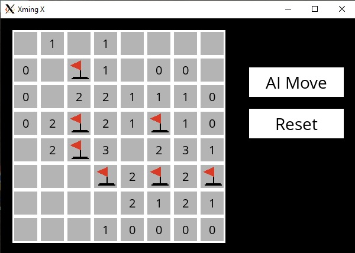

# minesweeper-ai
An implementation of the classic minesweeper game, with an AI agent



I completed this project as part CS50AI, Havard University's course in Artificial Intelligence in Python. Project requirements and key deliverables may be viewed [here](https://cs50.harvard.edu/ai/2020/projects/1/minesweeper/).
I implemented the AI logic in `minesweeper.py`, while the file `runner.py` was created by CS50AI staff and provided as part of the project brief. I have made one minor modification to the staff's code in `runner.py`, as commented at the head of the file.

Game moves may be played by a human, or an AI agent may be invoked to make a move. My implementation of the AI agent uses propositional logic to analyse the agent's knowledge of any revealed game cells, and infer the state of un-revealed cells when possible.

### To run:
```bash
user@user:~$python runner.py
``` 
(see note below for WSL / Win10)


#### Note to CS50AI students & staff:
My implementation of this project is available here temporarily and solely for the purposes of demonstrating my abilities to potential employers, as permitted by the course's guidelines. Viewing of this material by currently enrolled CS50AI students may constitute a violation of the course's academic integrity policy.


#### To run in WSL2 on Win10:
In Windows10 run `XLaunch.exe`, making sure to select `Disable Access Control`. This starts the Xming X server, to use as a GUI output device. XLaunch is available from [Sourceforge](https://sourceforge.net/projects/xming/).

You might also need to set the `DISPLAY` variable in WSL2:
```bash
user@user:~$export DISPLAY=$(grep nameserver /etc/resolv.conf | awk '{print $2}'):0.0
```

In runner.py, it might be necessary to add the following line to suppress audio errors:
```bash
user@user:~$os.environ["SDL_AUDIODRIVER"]="dsp"
```